# Screenshots of Tourists Club website

## Main Page
When visiting the main page, the guest sees a greeting and an invitation to login.
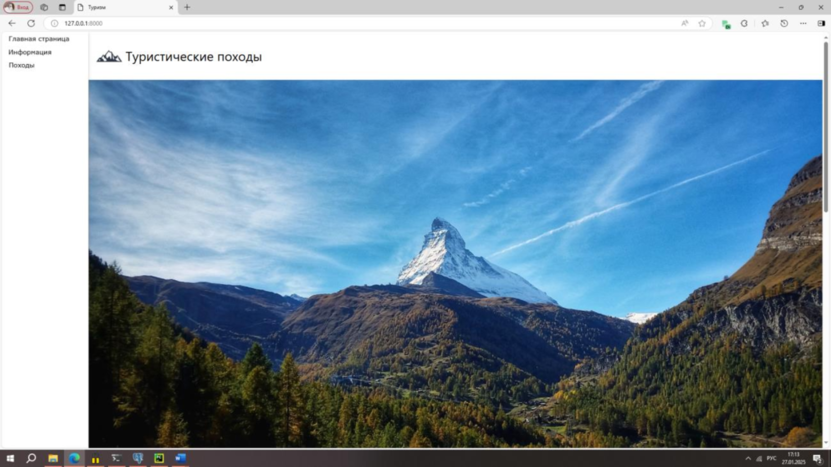

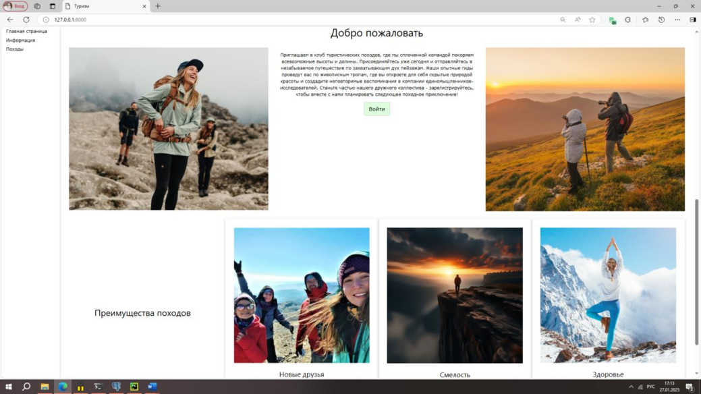

## Login page
The login page contains a login form or a redirect to the registration page (available only to guests).
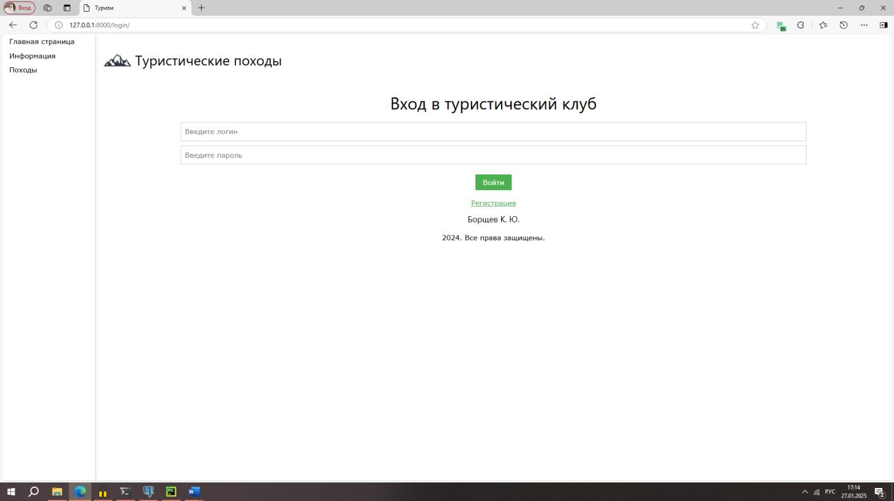

## Registration page
The registration page contains a registration form (available only to guests):
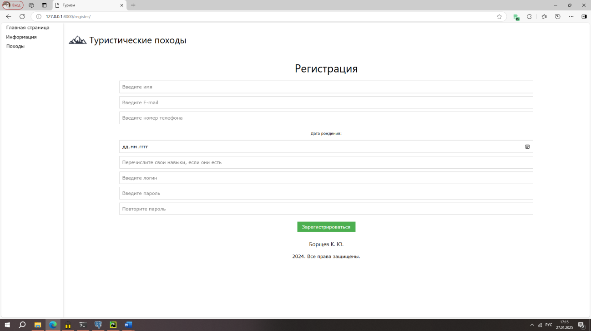

## Hikes page
A page with all the trips added to the website.
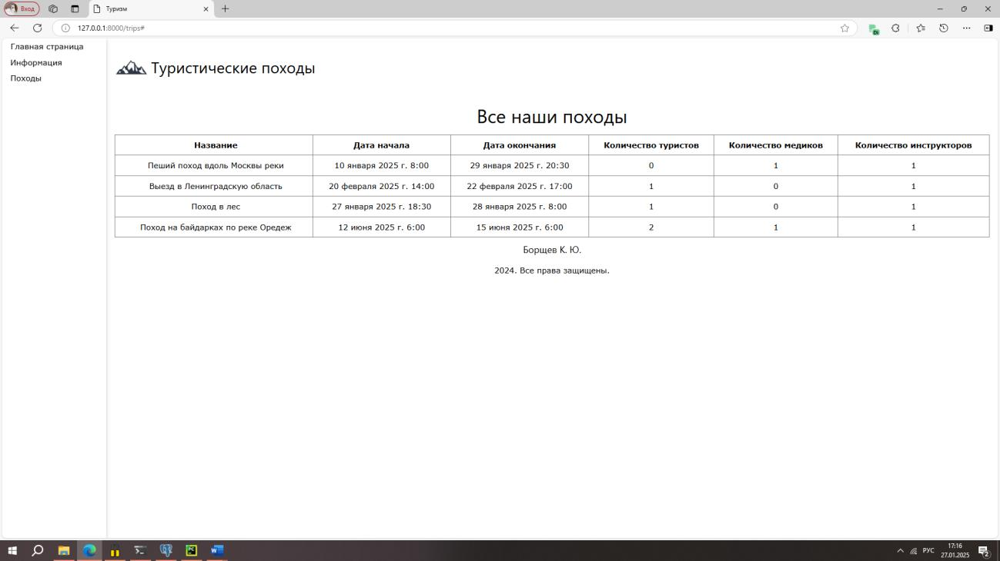

## Tourist Pages
When a user registers, they become a tourist.

Tourist's profile page:
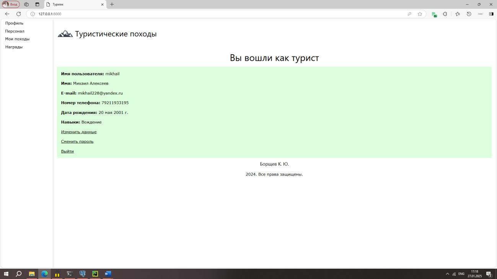

The tourist can also change their user data:
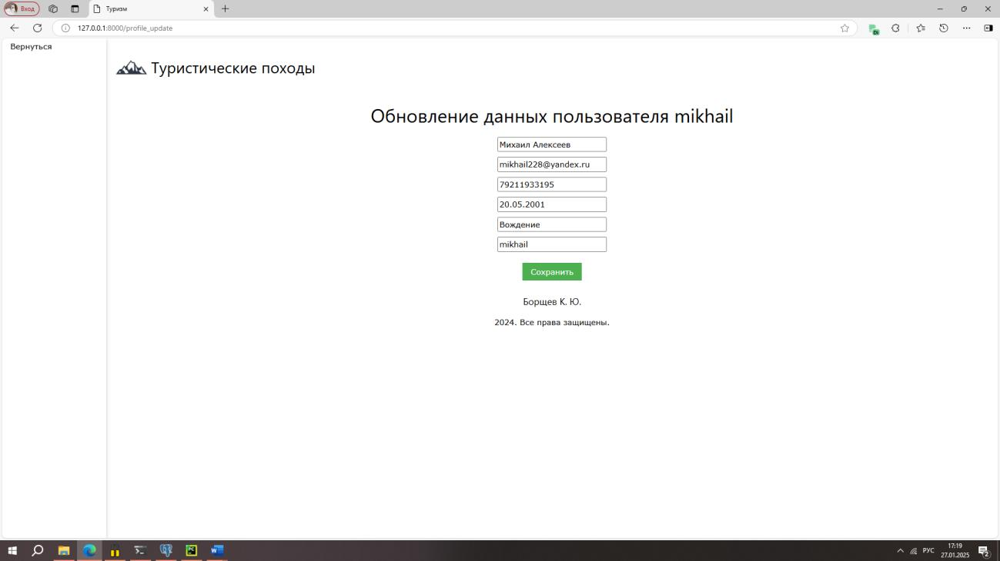

And change password:
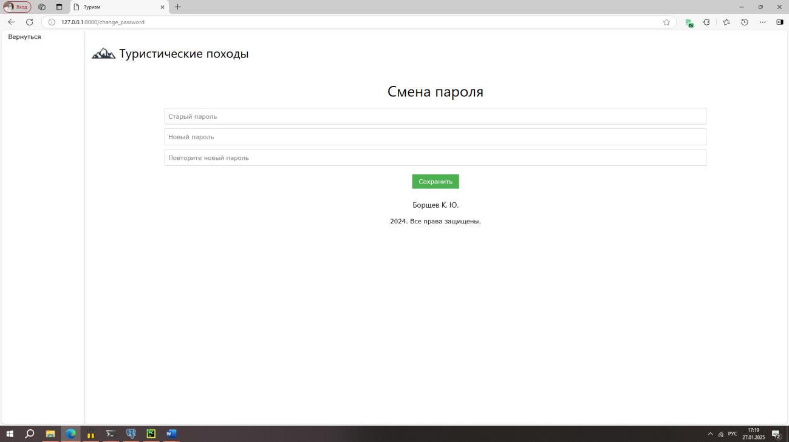

Can see all the working staff:
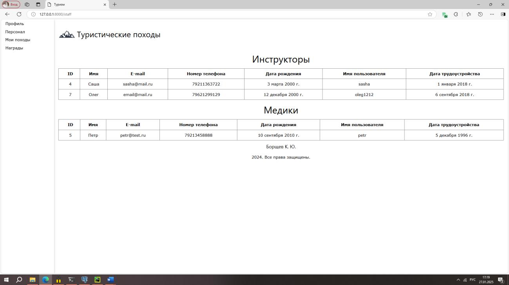

And all hikes data with the status of their hiking applications:
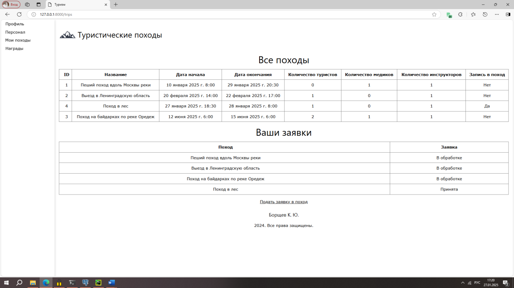

The tourist’s role can be changed by the administrator to the role of an employee.

## Instructor pages
The instructor can also change any information about themselves as a tourist.

And they can view the list of all their hikes with the option to change them:
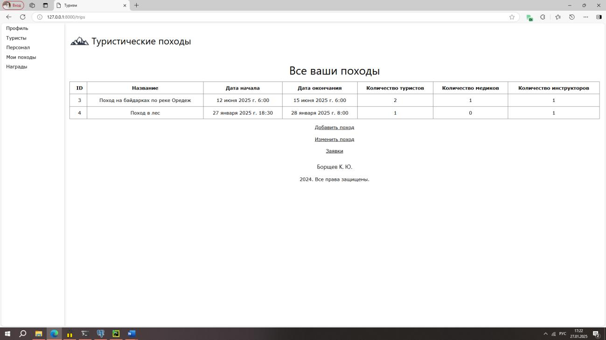

Adding a hike:
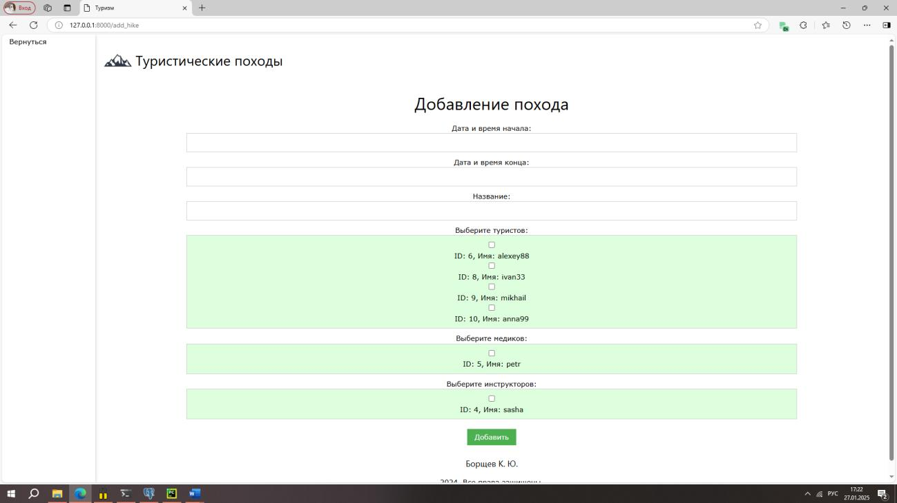

Changing the statuses of tourists’ trip applications:
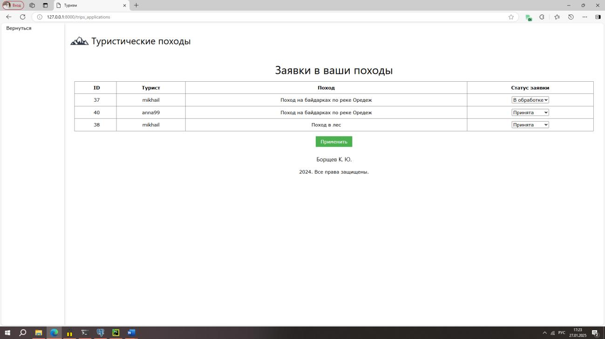

## Administrator pages
The administrator can see absolutely all users and their roles, and change absolutely any of their data.

He also has an admin panel with the ability to enter any SQL query:
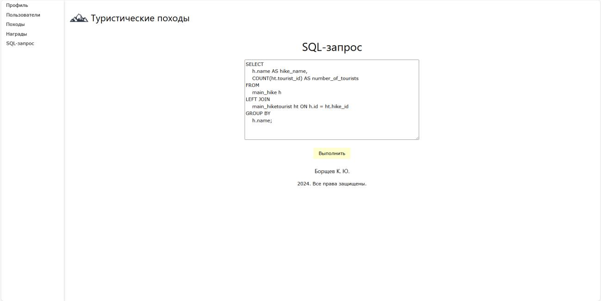

Example of a successful query execution:
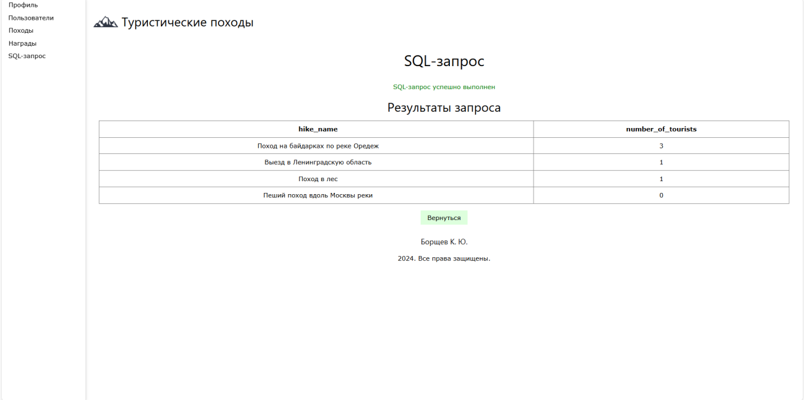

All SQL queries are executed successfully, including DDL queries (no result table is returned for them). If the query cannot be executed, an error is reported.
